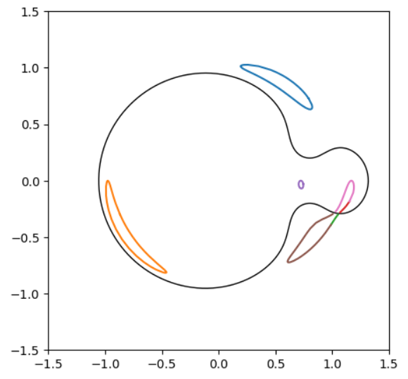
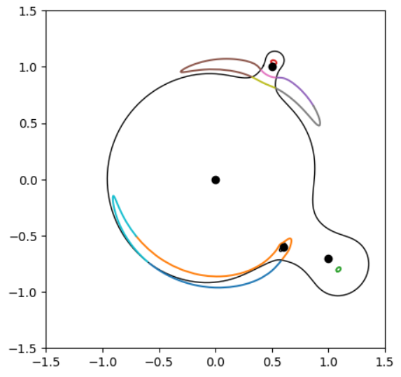

[Back to **Centroid Trajectories**](CentroidTrajectories.md)

# Advanced control

In this section we discuss some technical aspects that can be controlled by an advanced user.

Throughout our documentation we have recommended the use of `BinaryMag2` and `ESPLMag2`. These two functions start with a point-source calculation and evaluate the quadrupole correction. If this exceeds a dynamically calculated threshold, then the full extended-source calculation with contour integration is performed. All details about the quadrupole correction and the thresholds to switch from point-source to extended-source are illustrated in [V. Bozza et al., MNRAS 479 (2018) 5157](https://ui.adsabs.harvard.edu/abs/2018MNRAS.479.5157B/abstract). 

## Lower level functions for basic magnification calculations

The parent functions `BinaryMag2` and `ESPLMag2` call lower level functions for individual calculations. We already presented the `BinaryMag0` ([Binary Lenses section](BinaryLenses.md)) and `PSPLMag` ([Single Lenses section](SingleLenses.md)) functions for point-source calculations. 

Whenever the quadrupole test indicates that the point-source is inaccurate, the functions `BinaryMagDark` or `ESPLMagDark` are called to perform extended-source calculations including limb darkening. Also these functions are directly available to the user who might be interested in them for several reasons. The syntax is very simple:

```
Mag = VBM.BinaryMagDark(s, q, y1, y2, rho, accuracy) # Magnification of a limb-darkened source by a binary lens.
Mag = VBM.ESPLMagDark(u, rho) # Magnification of a limb-darkened source by a single lens.
```

As explained in the corresponding section, [Limb Darkening](LimbDarkening.md) is obtained by repeating contour integration on concentric annuli. The number and location of the annuli is decided dynamically comparing the accuracy goal with the difference in the results obtained on different contours. 

Both functions `BinaryMagDark` and `ESPLMagDark` call lower level functions to perform each individual contour integration on a uniform disk source. Such lower level functions are `BinaryMag` and `ESPLMag`, which are also accessible to the user and have a similar syntax

```
Mag = VBM.BinaryMag(s, q, y1, y2, rho, accuracy) # Magnification of a uniform source by a binary lens.
Mag = VBM.ESPLMag(u, rho) # Magnification of a uniform source by a single lens.
```

These functions are particularly useful for diagnostics on particular cases and for overriding the high-level control offered by `BinaryMag2` and `ESPLMag2`, if necessary. 

## Advanced contol in limb darkening

The number of annuli used in any magnification calculation on a limb-darkened source in VBMicrolensing is reported through the property `VBM.nannuli`. This can be a useful diagnostics to know how deep the calculation had to go in order to meet the required accuracy.

Furthermore, there are exceptional situations in which huge sources cover tiny caustics. If both the center and the margin of the source are far from the caustic, there is a chance that `BinaryMag2` does not judge worthwhile to insert any annuli in-between, thereby missing the subtle perturbation by the caustic. In these cases, the user may force VBMicrolensing to use a minimum number of annuli by changing  `VBM.minannuli`. 

For example, by setting 

`VBM.minannuli = 2`

there will always be one annulus between the center and the boundary of the source.

## Advanced control in contour integration

As metioned before, the basic function for contour integration of a uniform source in binary lensing is `BinaryMag`. The inversion of the lens equation is performed on a sample of points on the source boundary. The number and location of points on the source boundary is optimized by a careful estimate of the errors committed in the magnification calculation (see  [V. Bozza, MNRAS 408 (2010) 2188](https://ui.adsabs.harvard.edu/abs/2010MNRAS.408.2188B/abstract) for all details about the algorithm).

### Total number of points in contours

The total number of points on which the lens equation inversion is performed is reported by `VBM.NPS`. This diagnostics gives the possibility to quantify the computational load of a particular calculation. After a call to `BinaryMag`, `VBM.NPS` reports the number of points on the source boundary. After a call to `BinaryMagDark`, `VBM.NPS` reports the total number of points on all annuli used for the limb darkened magnification. After a call to `BinaryMag2`, `VBM.NPS` reports the total number of points used: either 1 for a point-source or the total number needed for the extended-source calculation.

### Setting the total number of points

`BinaryMag` increases the number of points in the sampling of the source boundary until the estimated error falls below the accuracy or precision thresholds fixed by `VBM.Tol` and `VBM.RelTol` (see [Accuracy Control](AccuracyControl.md)). Actually, the accuracy also appear as an explicit parameter in the function syntax
`VBM.BinaryMag(s, q, y1, y2, rho, accuracy);` After the function call, `VBM.Tol` is updated to the accuracy specified in the call.

However, the behavior of the function changes if an accuracy greater than 1 is specified. In this case, the accuracy parameter becomes the number of points to be used in the sampling of the source boundary. For example,  `VBM.BinaryMag(s, q, y1, y2, rho, 100);` will calculate the magnification on a boundary with 100 sampling points. The location of the points is still chosen so as to minimize the total error. 

This variant of `BinaryMag` can be useful to check how the algorithm proceeds up to a given density of the sampling and identify possible sources of errors.

### Estimated error

Another important diagnostics is the error estimate `VBM.therr`. As said before, the sampling on the source boundary is increased until the estimated error falls below the accuracy or precision thresholds fixed by `VBM.Tol` and `VBM.RelTol` (see [Accuracy Control](AccuracyControl.md)). However, when the input parameters are pushed to extreme values, numerical errors will eventually dominate and preclude any possibilities to meet the desired accuracy. `BinaryMag` will always try to return a reasonable estimate of the magnification by discarding problematic points on the source boundary. This comes to the cost of leaving irreducible errors in the final result. Therefore, `VBM.therr` can track such occurrences and report an error estimate that can be useful in these particular situations.

## Parameters ranges

VBMicrolensing has been widely tested with particular attention on caustic crossings and all source positions close to caustics. Here we report the recommended ranges of parameters for `BinaryMag2`.

Mass ratio: testing has been performed with $10^{-9} \leq q \leq 1$.

Failures (errors larger than accuracy goal specified by `VBM.Tol`) are below 1 in 1000 caustic crossings in the following ranges

$0.01< s < 10$ for $q = 1.0$

$0.1 < s < 2.5$ for $q=10^{-9}$

For intermediate mass ratios, these ranges can be easily interpolated.

Concerning the source coordinates $y_1$ and $y_2$, we have found no restrictions.

Above ranges apply to source radii $10^{-3}\leq \rho \leq 1.0$. Outside this range, the robustness slowly degrades.

Finally, we note that lower level functions such as `BinaryMag` and `BinaryMagDark` may have local failures which do not appear in `BinaryMag2`, which takes care of these particular cases.

## Image contours

In classical microlensing, only the total magnification and the astrometric centroid are of interest. However, for illustration purposes or for particular diagnostics, we may be interested in the individual image contours. These are available thanks to the functions `ImageContours` and `MultiImageContours`. Here is an illustrative example for a binary lens

```
import VBMicrolensing
VBM = VBMicrolensing.VBMicrolensing()
import matplotlib.pyplot as plt

s = 1  # Lens separation
q = 0.1 # Mass ratio
y1 = 0.1 # Source coordinate 1
y2 = 0.1 # Source coordinate 2
rho = 0.1 # Source radius

images = VBM.ImageContours(s, q, y1, y2, rho)  # Calculates the image contours and stores them in a list.

crits = VBM.Criticalcurves(s,q) # Let us also show the critical curves for this lens

fig, ax = plt.subplots(figsize=(5,5))
for crit in crits:
    ax.plot(crit[0],crit[1],'k', linewidth=1) # Plot the critical curves
for image in images:
    ax.plot(image[0],image[1]) # Plot the image contours
ran=1.5
ax.set_xlim(-ran,ran)
ax.set_ylim(-ran,ran)
```



And here is an example with a multiple lens

```
import VBMicrolensing
VBM = VBMicrolensing.VBMicrolensing()
import matplotlib.pyplot as plt

parameters = [0,0,1,            # First lens: x1_1, x1_2, m1
              1,-0.7,1.e-1,     # Second lens: x2_1, x2_2, m2
              0.5,1,1.e-2,      # Third lens: x3_1, x3_2, m3
              0.6,-0.6,1.e-3]    # Fourth lens: x4_1, x4_2, m4
y1 = 0.1 # Source coordinate 1
y2 = 0.1 # Source coordinate 2
rho = 0.1 # Source radius

VBM.SetLensGeometry(parameters) #Initialize the lens configuration

images = VBM.MultiImageContours(y1, y2, rho)  # Calculates the image contours and stores them in a list.

crits = VBM.Multicriticalcurves() # Let us also show the critical curves for this lens

fig, ax = plt.subplots(figsize=(5,5))
for crit in crits:
    ax.plot(crit[0],crit[1],'k', linewidth=1) # Plot the critical curves
for image in images:
    ax.plot(image[0],image[1]) # Plot the image contours
for i in range(int(len(parameters)/3)):
    ax.plot([parameters[i*3]],[parameters[i*3+1]],'ok') # Plot the lenses
ran=1.5
ax.set_xlim(-ran,ran)
ax.set_ylim(-ran,ran)
```


