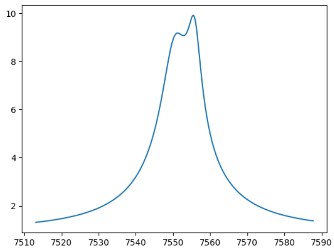
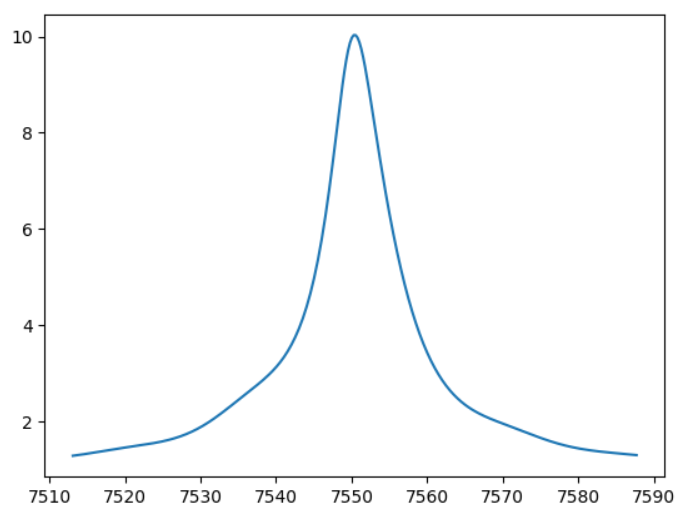

[Back to **Orbital motion**](OrbitalMotion.md)

# Binary sources

Binary sources just give the superposition of two single-source microlensing light curves. In VBMicrolensing we have the `BinSourceLightCurve` function, illustrated in the following example:

```
import VBMicrolensing
import math
import numpy as np
import matplotlib.pyplot as plt

VBM = VBMicrolensing.VBMicrolensing()

# Parameters
tE = 37.3  # Einstein time
FR = 0.4  # Flux ratio of the second source to the first
u01 = 0.1  # Impact parameter for source 1
u02 = 0.05  # Impact parameter for source 2
t01 = 7550.4  # Time of closest approach to source 1
t02 = 7555.8  # Time of closest approach to source 2

# Array of parameters. Note that tE and FR are in log-scale
pr = [math.log(tE), math.log(FR), u01, u02, t01, t02]

t = np.linspace(t01-tE, t01+tE, 300) # Array of times

magnifications, y1, y2 = VBM.BinSourceLightCurve(pr,t)      # Calculation of binary-source light curve

plt.plot(t,magnifications)
```


The output of BinSourceLightCurve is a magnification compared to the baseline flux. Therefore, it is the sum of two Paczynsky light curves weighted by 1/(1+FR) and FR/(1+FR) respectively.

Parallax is included in the `BinSourceLightCurveParallax` function, which accepts two more parameters for the parallax components, as illustrated in the [Parallax](Parallax.md) section.

## Extended binary sources

If the finite size of the sources is relevant, one can use `BinSourceExtLightCurve` function

```
rho = 0.1 # Size of source 1
pr = [math.log(tE), math.log(FR), u01, u02, t01, t02, math.log(rho)]
Mag, y1, y2 = VBM.BinSourceExtLightCurve(pr, t) # Calculates the magnification for extended binary sources
```

Only one source size is specified as an independent parameter, while the source size of the second source is obtained through mass-radius-luminosity relations. This ensures that the user has full control on the physical consistency of the model.

## Mass-radius-luminosity relations for binary sources

The mass-luminosity relation in VBMicrolensing is a power law of the form $L \sim M^q$ where the exponent $q$ is given by the variable `VBM.mass_luminosity_exponent`, whose default value is $4.0$.

The mass-radius relation is a power law of the form $\rho \sim M^p$ where the exponent $p$ is given by the variable `VBM.mass_radius_exponent`, whose default value is $0.9$.

Therefore, in the function `BinSourceExtLightCurve`, if the flux ratio is `FR` and the radius of the first source is `rho`, the radius of the second source is calculated as `rho * FR^{p/q}`.

The user can customize the two exponents by changing `VBM.mass_luminosity_exponent` and `VBM.mass_radius_exponent` as appropriate for the sources in the specific microlensing event and for the observation band.

## Xallarap

Binary sources can also orbit around a common center of mass. VBMicrolensing offers xallarap with circular orbital motion, described by 6 parameters:

$(\xi_\parallel, \xi_\perp)$, projections of the node lines parallel and perpendicular to the source velocity at time $t_0$. Note that the orbital radius in Einstein angle units is $\sqrt{\xi_\parallel^2 + \xi_\perp^2}$;

$\omega = \frac{2\pi}{T}$, orbital angular velocity;

$i$, inclination of the orbit;

$\phi_0$, phase at time $t_0$ from the line of nodes;

$q_s$, mass ratio of the two source components.

Here is an example with the function `BinSourceSingleLensXallarap`. You may note that the parametrization of the sources is very different with respect to the previous functions.

```
import VBMicrolensing
import math
import numpy as np
import matplotlib.pyplot as plt

VBM = VBMicrolensing.VBMicrolensing()

# Parameters
u0 = 0.1  # Impact parameter for the first source
t0 = 7550.4  # Time of closest approach for the first source
tE = 37.3  # Einstein time
rho = 0.004  # Radius of the first star
xi1 = 0.011  # Xallarap component 1
xi2 = 0.02  # Xallarap component 2
om = 0.4  # Orbital velocity
inc = 0.8  # Inclination
phi0 = 1.4  # Phase from the line of nodes
qs = 0.1  # Mass ratio of the two stars

# Array of parameters
pr = [u0, t0, math.log(tE), math.log(rho), xi1, xi2, om, inc, phi0, math.log(qs)]

magnifications, y11, y12, y21, y22 = VBM.BinSourceSingleLensXallarap(pr, t)

plt.plot(t,magnifications)
```


In this function we are assuming that all properties of the sources can be deduced by their mass ratio through the mass-radius-luminosity relations specified above and customizable by the user. Therefore, the flux ratio will be `FR = qs^q`, where `q` is given by `VBM.mass_luminosity_exponent` and the radius of the second source will be `rho * qs^p`, where `p` is given by `VBM.mass_radius_exponent`.

Xallarap is also available for binary lenses through the `BinSourceBinaryLensXallarap` function. In this case, the parameters are 13 with the seven parameters for the [static binary lens](BinaryLenses.md) followed by the six parameters for the xallarap.

[Go to **Advanced control**](AdvancedControl.md)
