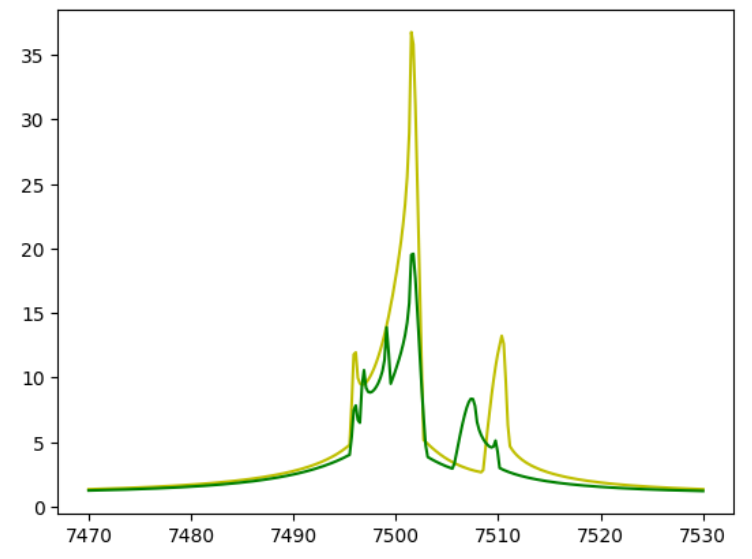
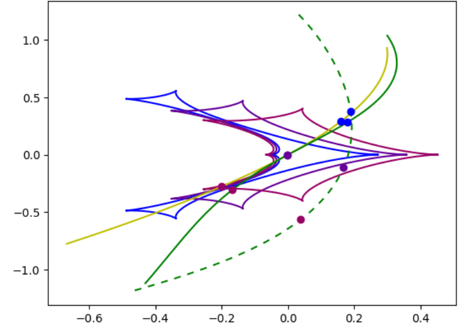

[Back to **Orbital motion**](OrbitalMotion.md)

# Binary sources

Binary sources just give the superposition of two single-source microlensing light curves. In VBMicrolensing we have the `BinSourceLightCurve` function, illustrated in the following example:

```
import VBMicrolensing
import math
import numpy as np
import matplotlib.pyplot as plt

VBM = VBMicrolensing.VBMicrolensing()

# Parameters
tE = 37.3  # Einstein time
FR = 0.4  # Flux ratio of the second source to the first
u01 = 0.1  # Impact parameter for source 1
u02 = 0.05  # Impact parameter for source 2
t01 = 7550.4  # Time of closest approach to source 1
t02 = 7555.8  # Time of closest approach to source 2

# Array of parameters. Note that tE and FR are in log-scale
pr = [math.log(tE), math.log(FR), u01, u02, t01, t02]

t = np.linspace(t01-tE, t01+tE, 300) # Array of times

magnifications, y1, y2 = VBM.BinSourceLightCurve(pr,t)      # Calculation of binary-source light curve

plt.plot(t,magnifications)
```


The output of BinSourceLightCurve is a magnification compared to the baseline flux. Therefore, it is the sum of two Paczynsky light curves weighted by 1/(1+FR) and FR/(1+FR) respectively.

Parallax is included in the `BinSourceLightCurveParallax` function, which accepts two more parameters for the parallax components, as illustrated in the [Parallax](Parallax.md) section.

## Extended binary sources

If the finite size of the sources is relevant, one can use `BinSourceExtLightCurve` function

```
rho = 0.1 # Size of source 1
pr = [math.log(tE), math.log(FR), u01, u02, t01, t02, math.log(rho)]
Mag, y1, y2 = VBM.BinSourceExtLightCurve(pr, t) # Calculates the magnification for extended binary sources
```

Only one source size is specified as an independent parameter, while the source size of the second source is obtained through mass-radius-luminosity relations. This ensures that the user has full control on the physical consistency of the model.

## Mass-radius-luminosity relations for binary sources

The mass-luminosity relation in VBMicrolensing is a power law of the form $L \sim M^q$ where the exponent $q$ is given by the variable `VBM.mass_luminosity_exponent`, whose default value is $4.0$.

The mass-radius relation is a power law of the form $\rho \sim M^p$ where the exponent $p$ is given by the variable `VBM.mass_radius_exponent`, whose default value is $0.9$.

Therefore, in the function `BinSourceExtLightCurve`, if the flux ratio is `FR` and the radius of the first source is `rho`, the radius of the second source is calculated as `rho * FR^{p/q}`.

The user can customize the two exponents by changing `VBM.mass_luminosity_exponent` and `VBM.mass_radius_exponent` as appropriate for the sources in the specific microlensing event and for the observation band.

## Dark secondary component

The secondary component is assumed to be luminous with a flux ration `FR` to the primary. However, if we want to model a source orbiting a dark object, we need to turn off the flux from the secondary component. This can be done by setting

```
VBM.turn_off_secondary_source = True
```

At this point, the flux ratio parameter can be easily converted to a mass ratio parameter by setting `VBM.mass_luminosity_exponent = 1`. Without a flux, the secondary component may only affect the microlensing event by the orbital motion of the primary around the common center of mass, which is described by the so-called xallarap effect.

## Xallarap

Binary sources orbit around a common center of mass. In this case, assuming a circular orbital motion, we have to add the three components of the relative velocity, similarly to what we do for binary lens orbital motion. We also include parallax componentes, although these are often degenerate with xallarap.

```
import VBMicrolensing
import math
import numpy as np
import matplotlib.pyplot as plt

VBM = VBMicrolensing.VBMicrolensing()
VBM.SetObjectCoordinates("17:51:40.2082 -29:53:26.502");

# Parameters
tE = 37.3  # Einstein time
FR = 0.4  # Flux ratio of the second source to the first
u01 = 0.1  # Impact parameter for source 1
u02 = 0.05  # Impact parameter for source 2
t01 = 7550.4  # Time of closest approach to source 1
t02 = 7555.8  # Time of closest approach to source 2
rho = 0.004  # Radius of the first star
paiN = 0.03     # North component of the parallax vector
paiE = -0.02     # East component of the parallax vector
w1 = 0.021   # Orbital motion component parallel to the primary source direction at time t01
w2 = -0.02   # Orbital motion component othogonal to the primary source direction at time t01
w3 = 0.03   # Orbital motion along the line of sight

# Array of parameters. Note that tE and FR are in log-scale
pr = [math.log(tE), math.log(FR), u01, u02, t01, t02, math.log(rho), paiN, paiE, w1, w2, w3]

t = np.linspace(t01-tE, t01+tE, 300) # Array of times

magnifications0, y01, y02 = VBM.BinSourceExtLightCurve(pr, t)
plt.plot(t,magnifications0)

magnifications, y11, y12, y21, y22 = VBM.BinSourceExtLightCurveXallarap(pr, t)
plt.plot(t,magnifications,'y')
```


The positions of the two sources can be also easily shown

```
plt.plot(y11,y12,'r')
plt.plot(y21,y22,'y')
```


This parameterization has the advantage of being a direct extension of the static binary source one. The mass ratio and the radius of the secondary sources are calculated using mass-radius-luminosity relations starting from the flux ratio, as explained before. If we set `VBM.turn_off_secondary_source = True` the secondary component will be dark, otherwise, both components will contribute to the total flux.

The coordinates of the second source at time $t_0$ are calculated as follows:

$$ s_1 = (t_E^{-1} + w_1)(t0_1-t0_2)$$
$$ s_2 = (u0_2-u0_1) + w_2(t0_1-t0_2)$$
$$s_3= -(s_1 w_1+s_2 w_2)/w_3$$

The 3d separation is then $s=\sqrt{s_1^2+s_2^2+s_3^2}$ in Einstein angle units.

The orbital velocity is $w=\sqrt{w_1^2+w_2^2+w_3^2}$ in Einstein units per day.


## Xallarap (alternative parameterization)

VBMicrolensing offers an alternative xallarap paramterezation, closer to some traditional ones appeared in the literature, described by 6 parameters:

$(\xi_\parallel, \xi_\perp)$, projections of the node lines parallel and perpendicular to the source velocity at time $t_0$. Note that the orbital radius in Einstein angle units is $\sqrt{\xi_\parallel^2 + \xi_\perp^2}$;

$\omega = \frac{2\pi}{T}$, orbital angular velocity;

$i$, inclination of the orbit;

$\phi_0$, phase at time $t_0$ from the line of nodes;

$q_s$, mass ratio of the two source components.

Here is an example with the function `BinSourceSingleLensXallarap`. You may note that the parametrization of the sources is very different with respect to the previous functions.

```
import VBMicrolensing
import math
import numpy as np
import matplotlib.pyplot as plt

VBM = VBMicrolensing.VBMicrolensing()

# Parameters
u0 = 0.1  # Impact parameter for the first source
t0 = 7550.4  # Time of closest approach for the first source
tE = 37.3  # Einstein time
rho = 0.004  # Radius of the first star
xi1 = 0.011  # Xallarap component 1
xi2 = 0.02  # Xallarap component 2
om = 0.4  # Orbital velocity
inc = 0.8  # Inclination
phi0 = 1.4  # Phase from the line of nodes
qs = 0.1  # Mass ratio of the two stars

# Array of parameters
pr = [u0, t0, math.log(tE), math.log(rho), xi1, xi2, om, inc, phi0, math.log(qs)]

magnifications, y11, y12, y21, y22 = VBM.BinSourceSingleLensXallarap(pr, t)

plt.plot(t,magnifications)
```


In this function we are assuming that all properties of the sources can be deduced by their mass ratio through the mass-radius-luminosity relations specified above and customizable by the user. Therefore, the flux ratio will be `FR = qs^q`, where `q` is given by `VBM.mass_luminosity_exponent` and the radius of the second source will be `rho * qs^p`, where `p` is given by `VBM.mass_radius_exponent`.

## Binary sources and Binary lenses

The general function for microlensing events with Binary sources + Binary lenses is `BinSourceBinLensLightCurve` and takes a total of 18 parameters:

```
import VBMicrolensing
import math
import numpy as np
import matplotlib.pyplot as plt

VBM = VBMicrolensing.VBMicrolensing()


s = 0.9       # Separation between the lenses
q = 0.1       # Mass ratio
u0 = 0.0       # Impact parameter with respect to center of mass
alpha = 1.0       # Angle of the source trajectory
rho = 0.01       # Source radius
tE = 30.0      # Einstein time in days
t0 = 7500      # Time of closest approach to center of mass
paiN = 0.3     # North component of the parallax vector
paiE = -0.2     # East component of the parallax vector
gamma1 = 0.011   # Orbital motion component ds/dt/s
gamma2 = -0.005   # Orbital motion component dalpha/dt
gamma3 = 0.005   # Orbital motion component dsz/dt/s

u02 = u0+ 0.2  # Impact parameter of the second source
t02 = t0+0.0    # Closest approach time of the second source
FR=1.0          # Flux ratio of the second source to the first
ws1 = 0.01      # Orbital component of the second source along the direction of motion
ws2 = 0.02      # Orbital component of the second source perpendicular to the direction of motion
ws3 = -0.015    # Orbital component of the second source along the line of sight


t = np.linspace(t0-tE, t0+tE, 300) # Array of times
VBM.SetObjectCoordinates("17:59:02.3 -29:04:15.2") # Assign RA and Dec to our microlensing event

# Array of parameters. Note that s, q, rho and tE are in log-scale
pr = [math.log(s), math.log(q), u0, alpha, math.log(rho), math.log(tE), t0, paiN, paiE, gamma1, gamma2, gamma3,
     u02, t02, math.log(FR), ws1, ws2, ws3]

# Let us first calculate the curve for a single source
magnificationsorb, y1orb, y2orb, sorb = VBM.BinaryLightCurveOrbital(pr,t)
plt.plot(t,magnificationsorb,"y")

# And now let us calculate with the bianry source
magnificationsbin, y1bin, y2bin, y21bin, y22bin, sbin = VBM.BinSourceBinLensLightCurve(pr,t)
plt.plot(t,magnificationsbin,"g")
```


The yellow light curve is for a single source and the green light curve is for two sources. 

The caustics and the corresponding source trajectories (dashed is the secondary source) are shown in the following figure:




[Go to **Centroid Trajectories**](CentroidTrajectories.md)
