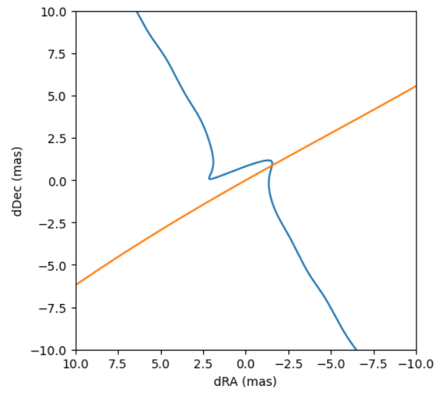
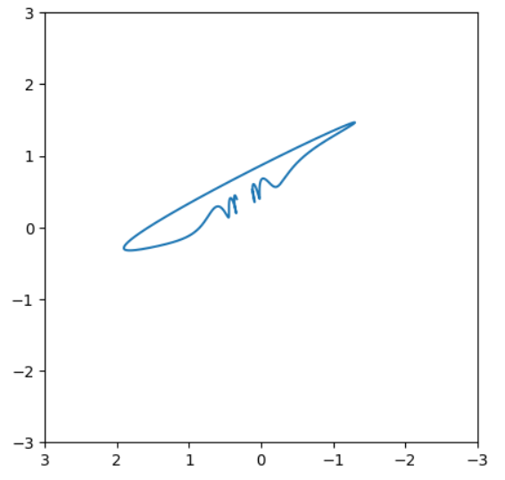
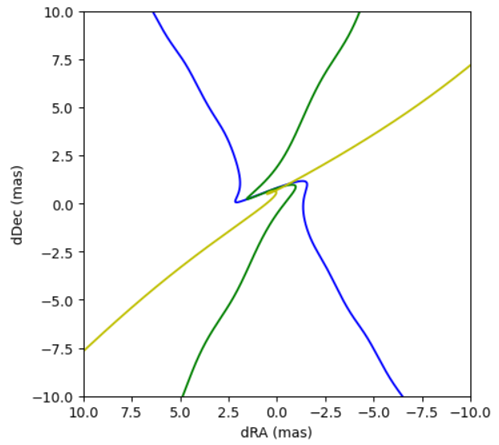

[Back to **Binary Sources**](BinarySources.md)

# Centroid Trajectories

All basic magnification functions illustrated in [Single Lenses](SingleLenses.md) and [Binary Lenses](BinaryLenses.md) allow the calculation of the centroid of the images in a frame centered on the lens in Einstein units.

However, in order to exploit this information and calculate the centroid positions in the sky during a microlensing event, we need some additional information:

1 - The source heliocentric proper motion in declination and right ascension in mas/yr.

2 - The source parallax in mas.

3 - The Einstein angle in mas.

The lens parallax and proper motion components are obtained from the source parallax and proper motion components once the microlensing parallax components $\pi_N,\pi_E$, Einstein angle and Einstein time are given. Therefore, they do not represent independent parameters.

## Astro-photometric functions

`VBMicrolensing` contains the following astro-photometric functions:

- **PSPLAstroLightCurve(parameters, times)**, extending PSPLLightCurveParallax <br/>
returns `[magnifications, source_centroid_dec, source_centroid_ra, lens_centroid_dec, lens_centroid_ra, y1_list, y2_list]`

- **ESPLAstroLightCurve(parameters, times)**, extending ESPLLightCurveParallax <br/>
returns `[magnifications, source_centroid_dec, source_centroid_ra, lens_centroid_dec, lens_centroid_ra, y1_list, y2_list]`

- **BinaryAstroLightCurve(parameters, times)**, extending BinaryLightCurveParallax <br/>
returns `[magnifications, source_centroid_dec, source_centroid_ra, lens_centroid_dec, lens_centroid_ra, y1_list, y2_list]`

- **BinaryAstroLightCurveOrbital(parameters, times)**, extending BinaryLightCurveOrbital <br/>
returns `[magnifications, source_centroid_dec, source_centroid_ra, lens_centroid_dec, lens_centroid_ra, y1_list, y2_list, separations_list]`

- **BinaryAstroLightCurveKepler(parameters, times)**, extending BinaryLightCurveKepler <br/>
returns `[magnifications, source_centroid_dec, source_centroid_ra, lens_centroid_dec, lens_centroid_ra, y1_list, y2_list, separations_list]`

- **BinSourceAstroLightCurveXallarap(parameters, times)**, extending BinSourceExtLightCurveXallarap <br/>
returns `[magnifications, source_centroid_dec, source_centroid_ra, lens_centroid_dec, lens_centroid_ra, y1_s1_list, y2_s1_list, y1_s2_list, y2_s2_list]`

- **BinSourceBinLensAstroLightCurve(parameters, times)**, extending BinSourceBinLensLightCurve <br/>
returns `[magnifications, source_centroid_dec, source_centroid_ra, lens_centroid_dec, lens_centroid_ra, y1_s1_list, y2_s1_list, y1_s2_list, y2_s2_list, separations_list]`

- **TripleAstroLightCurve(parameters, times)**, extending TripleLightCurveParallax <br/>
returns `[magnifications, source_centroid_dec, source_centroid_ra, lens_centroid_dec, lens_centroid_ra, y1_list, y2_list]`

Similarly to their corresponding original functions, these new functions take a parameters list and a list of observation times as arguments. The output contains a list of magnifications calculated at the epochs in `times`, centroid positions in (dec,ra) for source and lens, and source positions in the lens reference frame.

Here is a full example with the `PSPLAstroLightCurve`. For the other functions we just have to change the standard parameters accordingly, as explained in the corresponding sections [Light Curves](LightCurves.md), [Parallax](Parallax.md), [Orbital Motion](OrbitalMotion.md), [Binary Sources](BinarySources.md).

```
import VBMicrolensing
VBM = VBMicrolensing.VBMicrolensing()
import numpy as np
import math
import matplotlib.pyplot as plt

# Standard parameters for PSPL with parallax
t0 = 5034.0
tE = 27.0
u0 = 0.1
paiN = -0.1 
paiE = +0.2

# Additional parameters required for centroid trajectory
muS_Dec = -3.597 # Source proper motion (Dec) in mas/yr
muS_RA = -2.263 # Source proper motion (RA) in mas/yr
paiS = 0.12 # Source parallax in mas
thetaE = 5.15 # Einstein angle in mas

VBM.SetObjectCoordinates("17:51:40.2082 -29:53:26.502");  # Coordinates of the microlensing event

# Here we fill the array of parameters
pr = [u0,math.log(tE),t0, paiN,paiE,     # Standar light curve parameters for PSPL including parallax
     muS_Dec,muS_RA, paiS, thetaE]       # Additional parameters required for centroid trajectory

t = np.linspace(-3*365.25+t0,3*365.25+t0,10000) # Array of observation epochs

results = VBM.PSPLAstroLightCurve(pr,t)
magnifications = results[0]
plt.plot(t,magnifications) # Here we plot the light curve as usual
```


## Centroids for magnified source and lens

Now, let us plot the centroids for the magnified source and for the lens

```
sourcecentroid = [results[1],results[2]]
lenscentroid = [results[3],results[4]]

fig, ax = plt.subplots(figsize=(5,5))
ax.plot(sourcecentroid[1],sourcecentroid[0])
ax.plot(lenscentroid[1],lenscentroid[0])
ran = 10
ax.set_ylim(-ran,ran)
ax.set_xlim(ran,-ran)
ax.set_xlabel('dRA (mas)')
ax.set_ylabel('dDec (mas)')
```



In this figure the source centroid is in blue and the lens centroid is in yellow. We can appreciate the wiggles due to annual parallax (the time span is six years in this figure). The source is deflected at the time of the microlensing event.

We can subtract the average source proper motion to check the astrometric deflection

```
fig, ax = plt.subplots(figsize=(5,5))
ax.plot(np.array(sourcecentroid[1]) - muS_RA*(t - t0)/365.25,np.array(sourcecentroid[0]) - muS_Dec*(t - t0)/365.25)
ran = 3
ax.set_ylim(-ran,ran)
ax.set_xlim(ran,-ran)
```



Here we see the astrometric deflection along with the parallax wiggles, which have not been subtracted.

## Blending

Finally, we may combine lens and source centroid if we know the blending ratio $g = F_L/F_S$ using the function 'CombineCentroids'.

```
fig, ax = plt.subplots(figsize=(5,5))
g = 0.
combinedcentroid = VBM.CombineCentroids(results,g)
ax.plot(combinedcentroid[1],combinedcentroid[0],'b')
g = 0.1
combinedcentroid = VBM.CombineCentroids(results,g)
ax.plot(combinedcentroid[1],combinedcentroid[0],'g')
g = 1
combinedcentroid = VBM.CombineCentroids(results,g)
ax.plot(combinedcentroid[1],combinedcentroid[0],'y')
ran = 10
ax.set_ylim(-ran,ran)
ax.set_xlim(ran,-ran)
ax.set_xlabel('dRA (mas)')
ax.set_ylabel('dDec (mas)')
```



In this figure the blue line is the centroid trajectory for zero blending (basically the centroid for the magnified source), the green line is for blending = 0.1 and the yellow line for blending = 1. By increasing the blending, the lens dominates the centroid more and more.

## Binary lenses and binary sources

The lens centroid for binary lenses is not the center of mass but the center of light, which depends on the flux ratio, if both components are luminous. The flux ratio between the two lenses is determined using the mass ratio parameter $q$ and applying a mass-luminosity relation: $FR = q^p$, where $p$ can be set by the property `VBM.lens_mass_luminosity_exponent`. The default value is 4. This works also for planetary systems, since the flux ratio would be negligible. If we want to force the secondary to be dark, then we may set `VBM.turn_off_secondary_lens = True`. In this way, all the lens flux will come from the primary.

For binary sources, the centroid is determined using the flux ratio as already explained in [Binary Sources](BinarySources.md).

[Go to **Advanced control**](AdvancedControl.md)
