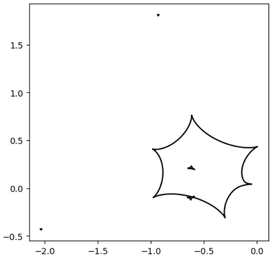

[Back to **Multiple lenses**](MultipleLenses.md)

# Critical curves and caustics

The gravitational lensing phenomenology is strictly related to the existence of critical curves and caustics (see the recommended [reviews](reviews.md) for a full treatment).

VBMicroLensing offers the calculation of critical curves and caustics with an arbitrary number of points through the functions ```Caustics``` and ```CriticalCurves``` for binary lenses, and `Multicaustics` and `Multicriticalcurves` for multiple lenses.

The result is a list of curves, where each curve is a pair of lists containing the x and y coordinates of the points along the curve. The use of these objects is very intuitive, as illustrated by these examples:

## Binary Lens

```
import VBMicrolensing
from matplotlib import pyplot as plt

VBM = VBMicrolensing.VBMicrolensing() # Instance to VBMicroLensing

# Parameters of our binary lens
s=0.6;  # separation between the two lenses
q=0.1;  # mass ratio

caustics = VBM.Caustics(s,q)

#plot
fig = plt.figure(figsize=(5, 5))
for cau in caustics:
        plt.plot(cau[0], cau[1], 'k')
```


Similarly for critical curves:

```
criticalcurves = VBM.Criticalcurves(s,q)

#plot
fig = plt.figure(figsize=(5, 5))
for crit in criticalcurves:
        plt.plot(crit[0], crit[1], 'k')
```


## Multiple Lens

```
import VBMicrolensing
from matplotlib import pyplot as plt

VBM = VBMicrolensing.VBMicrolensing() # Instance to VBMicroLensing

parameters = [0,0,1,
              -1.2,0.5,0.5,
              -1,0.4,1.1e-1,
              0.6,0,1.1e-2]

VBM.SetLensGeometry(parameters) #Initialize the lens configuration

caustics = VBM.Multicaustics()

#plot
fig = plt.figure(figsize=(5, 5))
for cau in caustics:
        plt.plot(cau[0], cau[1], 'k')
```


Similarly for critical curves:

```
criticalcurves = VBM.Multicriticalcurves()

#plot
fig = plt.figure(figsize=(5, 3))
for crit in criticalcurves:
        plt.plot(crit[0], crit[1], 'k')
```


Critical curves and caustics are calculated through the resolution of a complex polynomial of order $2N$ (see [reviews](reviews.md)) by the [Skowron & Gould algorithm](http://www.astrouw.edu.pl/~jskowron/cmplx_roots_sg/). 

The **number of points** calculated for the critical curves is controlled by ```VBM.NPcrit```, which can be changed by the user according to the desired sampling. The default value is 200.

[Go to: **Limb Darkening**](LimbDarkening.md)
