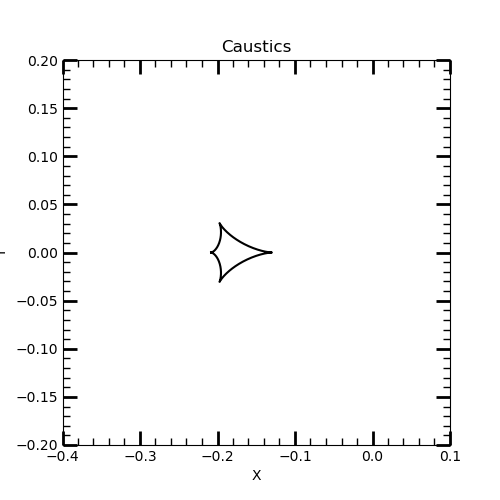
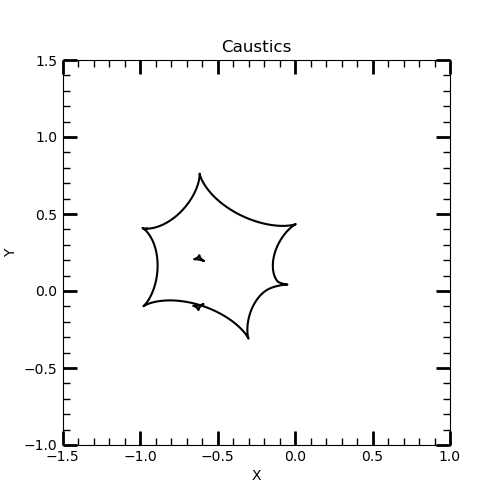

# <span style="color:red">VBMicrolensing</span>

[Back to **Binary lenses**](BinaryLenses.md)

# Critical curves and caustics

The gravitational lensing phenomenology is strictly related to the existence of critical curves and caustics (see the recommended [reviews](reviews.md) for a full treatment).

VBMicroLensing offers the calculation of critical curves and caustics with an arbitrary number of points through the functions ```Caustics``` and ```CriticalCurves```.

The result is a list object, which is a collection of pairs of lists for each curve. Each pair of lists represents the x-coordinate and the y-coordinate of the point.

The use of these objects is very intuitive, as illustrated by this examples:

## Binary Lens

```
import VBMicrolensing
from matplotlib import pyplot as plt

VBM = VBMicrolensing.VBMicrolensing() # Instance to VBMicroLensing

# Parameters of our binary lens
s=2.5;  # separation between the two lenses
q=0.1;  # mass ratio

caustics = VBM.Caustics(s,q)
criticalcurves=VBM.Criticalcurves(s,q)

#plot
fig = plt.figure(figsize=(5, 5))
for cau in caustics:
        plt.plot(cau[0], cau[1], 'k-', markersize=0.1)
plt.xlim(-0.4, 0.1)
plt.ylim(-0.2, 0.2)
plt.title('Caustics')
plt.xlabel('X')
plt.ylabel('Y')
plt.minorticks_on()
plt.tick_params(axis='both', which='major', width=2, length=10, direction='in', bottom=True, top=True, left=True, right=True)
plt.tick_params(axis='both', which='minor', width=1, length=5, direction='in', bottom=True, top=True, left=True, right=True)

```



## Multiple Lens

```
import VBMicrolensing
from matplotlib import pyplot as plt

VBM = VBMicrolensing.VBMicrolensing() # Instance to VBMicroLensing

parameters = [0,0,1,-1.2,0.5,0.5,-1,0.4,1.1e-1,0.6,0,1.1e-2]
#Within the parameter list are the lens details, as follows: [z1_re, z1_im, q1, z2_re, z2_im, q2,....,zn_re,zn_im,qn]

VBM.SetLensGeometry(parameters) #Initialize the lens configuration

caustics = VBM.Multicaustics()
criticalcurves=VBM.Multicriticalcurves()

#plot
fig = plt.figure(figsize=(5, 5))
for cau in caustics:
        plt.plot(cau[0], cau[1], 'k-', markersize=0.1)
plt.xlim(-1.5, 1)
plt.ylim(-1, 1.5)
plt.title('Caustics')
plt.xlabel('X')
plt.ylabel('Y')
plt.minorticks_on()
plt.tick_params(axis='both', which='major', width=2, length=10, direction='in', bottom=True, top=True, left=True, right=True)
plt.tick_params(axis='both', which='minor', width=1, length=5, direction='in', bottom=True, top=True, left=True, right=True)
```



Critical curves and caustics are calculated through the resolution of a fourth order complex polynomial (see [reviews](reviews.md)) by the [Skowron & Gould algorithm](http://www.astrouw.edu.pl/~jskowron/cmplx_roots_sg/). 

The **number of points** calculated for the critical curves is controlled by ```VBM.NPcrit```, which can be changed by the user according to the desired sampling. The default value is 200.

[Go to: **Limb Darkening**](LimbDarkening.md)
