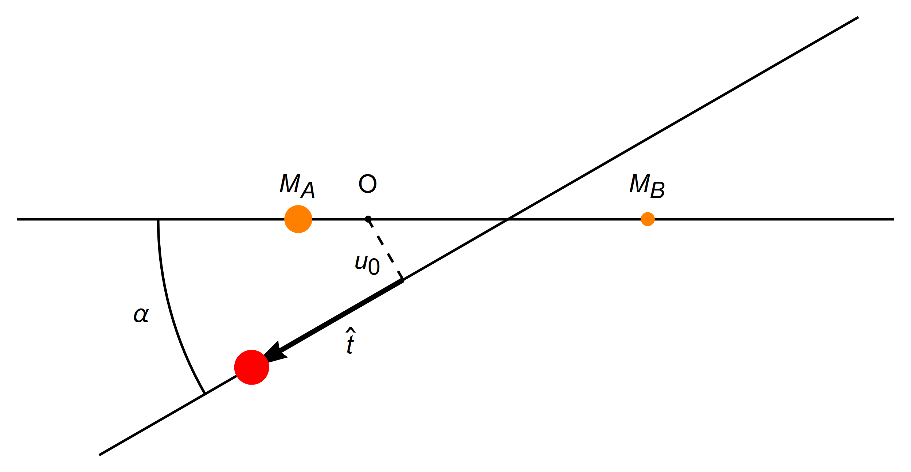
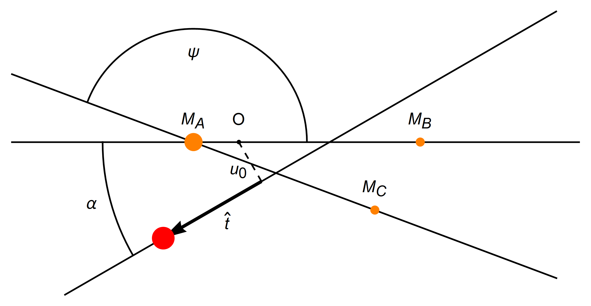

# <span style="color:red">VBMicrolensing</span>

[Back to **Accuracy Control**](AccuracyControl.md)

# Light Curve Functions

VBMicrolensing offers ready-to-use functions to calculate full microlensing light curves with standard parameters. There are functions for single and multiple lenses, single and binary sources, for light curves including parallax, orbital motion or xallarap.

Each of these functions comes in two flavors: calculation of a single point in the light curve with standard parameters; calculation of the whole light curve on an array of times with a single function call.

We start by explaining the single-point versions for each physical case and then we discuss the full light curve calculation in the end.

## Point-Source-Point-Lens light curve

Let us start with the Paczynski curve (see [Single lenses](SingleLenses.md) section). 

For the calculation of the light curve on a specific time `t`, we just need to define the array of standard parameters as shown in the following example and call the function `PSPLLightCurve`:

```
import VBMicrolensing
import math

VBM = VBMicrolensing.VBMicrolensing()

pr = [0, 0, 0]  # Array of parameters
u0, t0, tE = 0.01, 7550.4, 100.3  # Impact parameter, Time of closest approach, Einstein time

pr[0] = math.log(u0)  # Note that we give some parameters in log scale
pr[1] = math.log(tE)
pr[2] = t0

t = [7551.6]  # Time at which we want to calculate the magnification

Mag = VBM.PSPLLightCurve(pr, t)  # Calculates the PSPL magnification at different times with parameters in pr

print(f"PSPL Light Curve at time t: {Mag[0][0]}")  # Output should be 64.13...
```
The array `Mag` contains the magnification for the time specified in the array `t`.

Moreover, the source trajectory relative to the lens can be found in `Mag[1]` for y1s and in `Mag[2]` for y2s, which can be useful for plotting the source trajectory as discussed earlier.

The use of logarithms for some parameters is useful e.g. in Markov chains or other fitting algorithms when the possible values that occur in real cases may span several orders of magnitudes.

To make contact with the section [Single lenses](SingleLenses.md), we also report how the source position is calculated with our standard parameters:

$$y_1=-\frac{t-t_0}{t_E}$$

$$y_2=-u_0$$

$$u=\sqrt{y_1^2+y_2^2}$$

$u$ is the source angular separation relative to the lens in Einstein radii, as discussed in the section [Single lenses](SingleLenses.md).

The coordinates of the source at time $t$ as found by these formulae are stored in the public properties `VBM.y_1` and `VBM.y_2` of the VBMicrolensing class. For a PSPL model there is rotational symmetry, so we do not care too much about the role of y1 and y2, but this notation is consistent with that used for binary lenses. The information on the source position can be useful to draw plots with the source trajectory relative to the caustics.

## Extended-Source-Point-Lens light curve

Everything is similar to what we already discussed before. We just have the source radius as an additional parameter

```
import VBMicrolensing
import math

VBM = VBMicrolensing.VBMicrolensing()

pr = [0, 0, 0, 0]  # Array of parameters
u0, t0, tE, rho = 0.01, 7550.4, 100.3, 0.01  # Impact parameter, Time of closest approach, Einstein time, Source radius

pr[0] = math.log(u0)  # Note that we give some parameters in log scale
pr[1] = math.log(tE)
pr[2] = t0
pr[3] = math.log(rho)

t = [7551.6]  # Time at which we want to calculate the magnification

VBM.LoadESPLTable("ESPL.tbl")  # Do not forget to load the pre-calculated tables before the first ESPL calculation!
#Copy the file from the data folder to your path.

Mag = VBM.ESPLLightCurve(pr, t)  # Calculates the ESPL magnification at time t with parameters in pr
print("ESPL Light Curve at time t:", Mag[0][0])  # Output should be 68.09...
```

The source position is calculated in the same way as for the `PSPLLightCurve` function. All considerations about [Limb Darkening](LimbDarkening.md) apply to this function as well.


## Binary Lens light curve

A minimum set of parameters in binary lensing also includes the mass ratio q, the separation s and the angle $\alpha$ between the source trajectory and the binary lens axis. We remind that our coordinate system has its origin in the center of mass, with the first lens on the left and the second lens on the right (see [BinaryLenses](BinaryLenses.md)). The source trajectory is parameterized as follows:

$$ \hat t = \frac{t-t_0}{t_E} $$

$$ y_1 = u_0 ~ \sin(\alpha) - \hat t ~ \cos(\alpha) $$

$$ y_2 = -u_0 ~ \cos(\alpha) - \hat t ~ \sin(\alpha) $$ 



Let us see an example:

```
import VBMicrolensing
import math

VBM = VBMicrolensing.VBMicrolensing()

pr = [0, 0, 0, 0, 0, 0, 0]  # Array of parameters
u0, t0, tE, rho, alpha, s, q = -0.01, 7550.4, 100.3, 0.01, 0.53, 0.8, 0.1  # Impact parameter, Time of closest approach, Einstein time, Source radius, Angle of the source trajectory, Separation between the two lenses, Mass ratio

pr[0] = math.log(s)
pr[1] = math.log(q)
pr[2] = u0
pr[3] = alpha
pr[4] = math.log(rho)
pr[5] = math.log(tE)
pr[6] = t0

t = [7551.6]  # Time at which we want to calculate the magnification

Mag = VBM.BinaryLightCurve(pr, t)  # Calculates the Binary Lens magnification at time t with parameters in pr
print("Binary Light Curve at time t:", Mag[0][0])  # Output should be 31.00...
```

As before, the coordinates of the source are stored in the `Mag` array. These can be useful to draw the source trajectory relative to the caustics.

[Limb Darkening](LimbDarkening.md) and [accuracy goal](AccuracyControl.md) can be specified as shown in the respective sections.

We finally mention a possible variant in the parameterization. With the function `BinaryLightCurveW` the time of closest approach `t0` and the impact parameter `u0` are relative to the position of the caustic of the mass on the right, whose center lies at coordinates 

$$\left(\frac{1}{1+q} \left( s - \frac{1}{s} \right), 0 \right)$$

This parameterization is useful for fitting wide binary models.

## Triple Lens light curve


In the triple light curve, we add three parameters: the separation of the third lens relative to the primary, the mass ratio of the third lens relative to the primary, and the angle $\psi$, which is the angular separation of the third lens relative to the line connecting the primary and the secondary lens. Similar to the binary case, the coordinate system has its origin at the center of mass.



Let us see an example:

```
import VBMicrolensing
import math

VBM = VBMicrolensing.VBMicrolensing()

s12 = 0.765 # Separation between the first two lenses in descending order of mass in units of total ang. Einstein radii
q2 = 0.00066 # Mass ratio lens 2
u0 = 0.0060 # impact parameter
alpha= 3.212 
rho = 0.0567 # source radius in Einstein radii of the total mass.
tE = 50.13 # einstein radius crossing time
t0 = 0 # time of peak magnification
s23=1.5 #separation between the last two lenses in descending order of mass in units of total ang. Einstein radii
q3=0.000001 # Mass ratio lens 3
psi=-1.5 

num_points = 1000 # Number of points in the light curve

t=[0.1]

parameters = [math.log(s12), math.log(q2), u0, alpha, math.log(rho), math.log(tE), t0, math.log(s23), math.log(q3), psi]

# Set the Method that you want use : Singlepoly, Multipoly, Nopoly.
VBM.SetMethod(VBM.Method.Nopoly)

Mag = VBM.TripleLightCurve(parameters, t)

print("Triple Light Curve at time t:", Mag[0][0])  # Output should be 35.17...
```

## Full light curve with one call

We may want to calculate the full light curve on an array of times. For example if we have a set of observations taken by a given telescope or if we want to simulate a light curve with a given time sampling. All light curve functions in VBMicrolensing have an overload in which the time `t` is replaced by an array of times as additional argument. Furthermore, we also need to give the locations where the outputs must be stored. This means that the function expects an array for the magnification, an array for the source coordinate y1 and one more for the coordinate y2, as shown in the following example, which refers to the PSPL light curve.

```
import VBMicrolensing
import math

VBM = VBMicrolensing.VBMicrolensing()

pr = [0, 0, 0]  # Array of parameters

np = 100  # Number of points in the light curve

u0, t0, tE = 0.01, 7550.4, 100.3  # Impact parameter, Time of closest approach, Einstein time

pr[0] = math.log(u0)  # Note that we give some parameters in log scale
pr[1] = math.log(tE)
pr[2] = t0

times=[]
# Suppose we want to simulate the light curve with a fixed time sampling
for i in range(np):
    times.append(t0 - tE + 2 * tE / np * i)

Mags=VBM.PSPLLightCurve(pr, times)  # Calculates the whole light curve and stores the magnifications in the array mags

# Let's print the results
for i in range(np):
    print(times[i], Mags[0][i], Mags[1][i], Mags[2][i])
```
The array `Mags` contains the magnification and the source position for each time specified in the array `times`.

Apart from the compactness of the code, some computational advantage of the use of the single-call light curve function emerges with higher order effects, in which some calculations are re-used and not repeated at every function call.

The full light curve calculation is available for each physical scenario (PSPL, ESPL, Binary, Triple, Multiple) using the same syntax as described for single time cases.

[Go to **Parallax**](Parallax.md)
