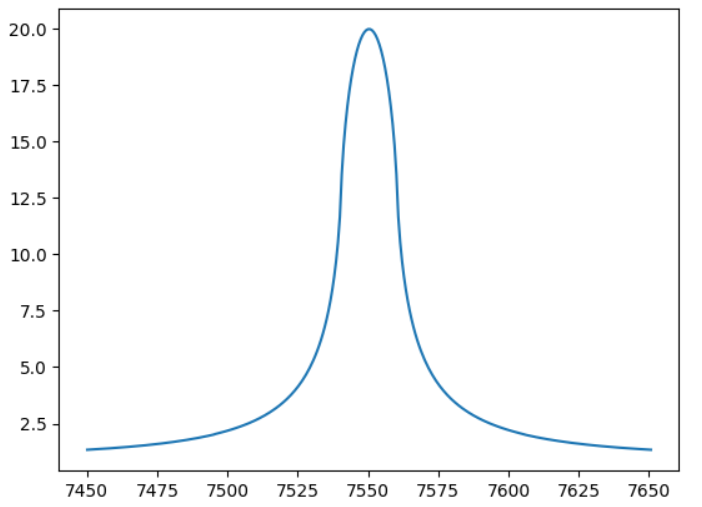
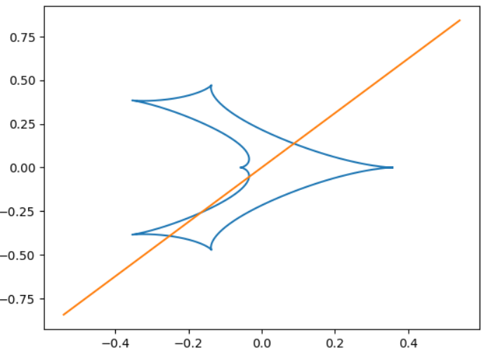

[Back to **Accuracy Control**](AccuracyControl.md)

# Light Curve Functions

VBMicrolensing offers ready-to-use functions to calculate full microlensing light curves with standard parameters. There are functions for single and multiple lenses, single and binary sources, for light curves including parallax, orbital motion or xallarap.

## Point-Source-Point-Lens light curve

Let us start with the Paczynski curve (see [Single lenses](SingleLenses.md) section). 

For the calculation of the light curve, we have to prepare the array of times at which we wish to calculate the light curve and then define the array of standard parameters as shown in the following example and finally call the function `PSPLLightCurve`:

```
import VBMicrolensing
import math
import numpy as np

VBM = VBMicrolensing.VBMicrolensing()

u0, t0, tE = 0.01, 7550.4, 100.3  # Impact parameter, Time of closest approach, Einstein time

# Array of parameters
pr = [math.log(u0),  # Note that we give some parameters in log scale
      math.log(tE),
      t0]

t = np.linspace(t0-tE, t0+tE, 300)  # Times at which we want to calculate the magnification

results = VBM.PSPLLightCurve(pr, t)  # Calculates the PSPL magnification at different times with parameters in pr

magnifications = results[0]  # array of magnifications at each time in t
y1 = results[1] # Source trajectory
y2 = results[2] 
```
The `PSPLLightCurve` function returns a list of three arrays: the array of magnifications and the two components of the source trajectory in the source plane.

The use of logarithms for some parameters is useful e.g. in Markov chains or other fitting algorithms when the possible values that occur in real cases may span several orders of magnitudes.

To make contact with the section [Single lenses](SingleLenses.md), we also report how the source position is calculated with our standard parameters:

$$y_1=-\frac{t-t_0}{t_E}$$

$$y_2=-u_0$$

$$u=\sqrt{y_1^2+y_2^2}$$

$u$ is the source angular separation relative to the lens in Einstein radii, as discussed in the section [Single lenses](SingleLenses.md).

For a PSPL model there is rotational symmetry, so we do not care too much about the role of y1 and y2, but this notation is consistent with that used for binary lenses. The information on the source position can be useful to draw plots with the source trajectory relative to the caustics, as shown below.

Let us plot the PSPL light curve thus obtained:
```
import matplotlib.pyplot as plt
plt.plot(t,magnifications)
```


## Extended-Source-Point-Lens light curve

Everything is similar to what we already discussed before. We just have the source radius as an additional parameter

```
import VBMicrolensing
import math
import numpy as np

VBM = VBMicrolensing.VBMicrolensing()

u0, t0, tE, rho = 0.01, 7550.4, 100.3, 0.1  # Impact parameter, Time of closest approach, Einstein time, Source radius

# Array of parameters
pr = [math.log(u0),  # Note that we give some parameters in log scale
      math.log(tE),
      t0,
      math.log(rho)]

t = np.linspace(t0-tE, t0+tE, 300)  # Times at which we want to calculate the magnification

results = VBM.ESPLLightCurve(pr, t)  # Calculates the ESPL magnification at different times with parameters in pr

magnifications = results[0]  # array of magnifications at each time in t
y1 = results[1] # Source trajectory
y2 = results[2]

import matplotlib.pyplot as plt
plt.plot(t,magnifications)
```


The source position is calculated in the same way as for the `PSPLLightCurve` function. All considerations about [Limb Darkening](LimbDarkening.md) apply to this function as well.


## Binary Lens light curve

A minimum set of parameters in binary lensing also includes the mass ratio q, the separation s and the angle $\alpha$ between the source trajectory and the binary lens axis. We remind that our coordinate system has its origin in the center of mass, with the first lens on the left and the second lens on the right (see [BinaryLenses](BinaryLenses.md)). The source trajectory is parameterized as follows:

$$ \hat t = \frac{t-t_0}{t_E} $$

$$ y_1 = u_0 ~ \sin(\alpha) - \hat t ~ \cos(\alpha) $$

$$ y_2 = -u_0 ~ \cos(\alpha) - \hat t ~ \sin(\alpha) $$ 


Let us see an example:

```
import VBMicrolensing
import math
import numpy as np
import matplotlib.pyplot as plt

VBM = VBMicrolensing.VBMicrolensing()

s = 0.9       # Separation between the lenses
q = 0.1       # Mass ratio
u0 = 0.0       # Impact parameter with respect to center of mass
alpha = 1.0       # Angle of the source trajectory
rho = 0.01       # Source radius
tE = 30.0      # Einstein time in days
t0 = 7500      # Time of closest approach to center of mass

# Array of parameters. Note that s, q, rho and tE are in log-scale
pr = [math.log(s), math.log(q), u0, alpha, math.log(rho), math.log(tE), t0]

t = np.linspace(t0-tE, t0+tE, 300) # Array of times

magnifications, y1, y2 = VBM.BinaryLightCurve(pr,t)      # Calculation of binary-lens light curve

plt.plot(t,magnifications)
```


As before, the coordinates of the source are stored in the `y1` and  `y2` arrays. These can be useful to draw the source trajectory relative to the caustics.

```
caustics = VBM.Caustics(s,q)
for cau in caustics:
    plt.plot(cau[0],cau[1])
plt.plot(y1,y2)
```



[Limb Darkening](LimbDarkening.md) and [accuracy goal](AccuracyControl.md) can be specified as shown in the respective sections.

We finally mention a possible variant in the parameterization. With the function `BinaryLightCurveW` the time of closest approach `t0` and the impact parameter `u0` are relative to the position of the caustic of the mass on the right, whose center lies at coordinates 

$$\left(\frac{1}{1+q} \left( s - \frac{1}{s} \right), 0 \right)$$

This parameterization is useful for fitting wide binary models.

## Triple Lens light curve


In the triple light curve, we add three parameters: the separation of the third lens relative to the primary, the mass ratio of the third lens relative to the primary, and the angle $\psi$, which is the angular separation of the third lens relative to the line connecting the primary and the secondary lens. Similar to the binary case, the coordinate system has its origin at the center of mass of the first two bodies.


Let us see an example:

```
import VBMicrolensing
import math
import numpy as np
import matplotlib.pyplot as plt

VBM = VBMicrolensing.VBMicrolensing()

s = 0.9       # Separation between the second and first lens
q = 0.1       # Mass ratio of the second lens to the primary
u0 = 0.0       # Impact parameter with respect to center of mass of the first two lenses
alpha = 1.0       # Angle of the source trajectory
rho = 0.01       # Source radius
tE = 30.0      # Einstein time in days
t0 = 7500      # Time of closest approach to center of mass of the first two lenses
s13 = 1.5      # Separation between the third lens and the primary
q3 = 0.003     # Mass ratio of the third lens to the primary
psi = 1.     # Angle between second and third lens as shown in figure

# Array of parameters. Note that s, q, rho, tE, s13 and q3 are in log-scale
pr = [math.log(s), math.log(q), u0, alpha, math.log(rho), math.log(tE), t0, math.log(s13), math.log(q3), psi]

t = np.linspace(t0-tE, t0+tE, 300) # Array of times

magnifications, y1, y2 = VBM.TripleLightCurve(pr,t)      # Calculation of triple-lens light curve

plt.plot(t,magnifications)
```


and then the corresponding source trajectory on the caustics
```
caustics = VBM.Multicaustics()
for cau in caustics:
    plt.plot(cau[0],cau[1],"r")
plt.plot(y1,y2)
```


[Go to **Parallax**](Parallax.md)
