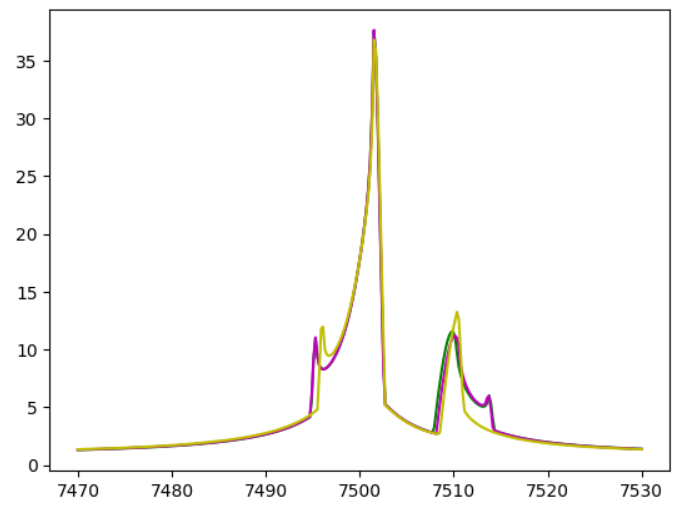
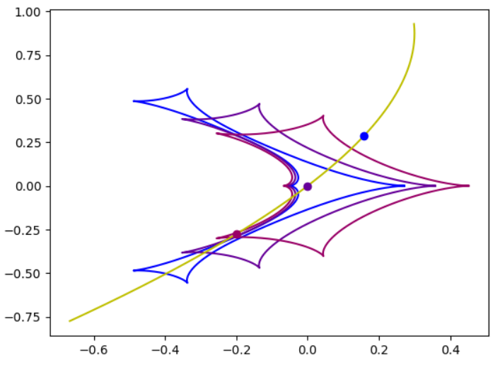

[Back to **Parallax**](Parallax.md)

# Orbital motion

Binary lenses orbit around the common center of mass. If the microlensing event is long enough, we should take orbital motion into account. However, to first order, microlensing is only sensitive to changes in the projected separation and orientation of the binary lenses, while most orbital parameters remain unconstrained. Rather than adding too many dimensions to our parameter space, in order to describe the subtle deviations in our microlensing event, it can be sufficient to restrict to circular orbits.

VBMicrolensing offers two functions:

```
BinaryLightCurveOrbital
BinaryLightCurveKepler
```

The first function describes circular orbital motion, while the second considers elliptic Keplerian orbital motion. Note that we deprecate the "linear approximation", which is popular in many microlensing papers, since it does not correspond to any physical trajectories and may lead to unphysical solutions.

Both functions discussed here include the parallax calculation. Therefore, a preliminary call to `VBM.SetObjectCoordinates` is mandatory (see [Parallax](Parallax.md)). If you want to fit orbital motion without parallax, you may set the two components of the parallax to zero.

Finally, the reference time for orbital motion calculation is by default $t_{0,orb}=t_0$, i.e. the time of closest approach of the source to the center of mass. If you want to specify a different time, you can do it through $t_{0,par}$ (see [Parallax](Parallax.md#reference-time-for-parallax-t_0par)). There is no possibility to set two different reference times. Therefore, in VBMicrolensing we always have $t_{0,orb} = t_{0,par}$.

## Circular orbital motion

Here is an example of use of `BinaryLightCurveOrbital`:

```
import VBMicrolensing
import math
import numpy as np
import matplotlib.pyplot as plt

VBM = VBMicrolensing.VBMicrolensing()

s = 0.9       # Separation between the lenses
q = 0.1       # Mass ratio
u0 = 0.0       # Impact parameter with respect to center of mass
alpha = 1.0       # Angle of the source trajectory
rho = 0.01       # Source radius
tE = 30.0      # Einstein time in days
t0 = 7500      # Time of closest approach to center of mass
paiN = 0.3     # North component of the parallax vector
paiE = -0.2     # East component of the parallax vector
gamma1 = 0.011   # Orbital motion component ds/dt/s
gamma2 = -0.005   # Orbital motion component dalpha/dt
gamma3 = 0.005   # Orbital motion component dsz/dt/s

# Array of parameters. Note that s, q, rho and tE are in log-scale
pr = [math.log(s), math.log(q), u0, alpha, math.log(rho), math.log(tE), t0, paiN, paiE, gamma1, gamma2, gamma3]

t = np.linspace(t0-tE, t0+tE, 300) # Array of times

VBM.parallaxsystem = 1       # Set parallax system to North-East
VBM.SetObjectCoordinates("17:59:02.3 -29:04:15.2") # Assign RA and Dec to our microlensing event

magnifications, y1, y2 = VBM.BinaryLightCurve(pr,t)      # Calculation of static binary-lens light curve
magnificationspar, y1par, y2par = VBM.BinaryLightCurveParallax(pr,t)      # Calculation of light curve with parallax
magnificationsorb, y1orb, y2orb, sorb = VBM.BinaryLightCurveOrbital(pr,t)      # Calculation of light curve with orbital motion

plt.plot(t,magnifications,"g")
plt.plot(t,magnificationspar,"m")
plt.plot(t,magnificationsorb,"y")
```



The light curve including orbital motion is in yellow in this plot. 

Note that the `BinaryLightCurveOrbital` returns magnifications, source positions and one additional list containing the separation between the two lenses as it evolves under the orbital motion. This is a very important information because caustics rapidly change with the separation between the lenses.

In the plot for the source trajectory, we can plot caustics at different times with different colors. Here is an example

```
caustictimes = [100,150,200]
colors = [(0,0,1,1),(0.4,0,0.6,1),(0.6,0,0.4,1)]
for i in range(0,3):
    caustics = VBM.Caustics(sorb[caustictimes[i]],q)
    for cau in caustics:
        plt.plot(cau[0],cau[1],color = colors[i])
plt.plot(y1orb,y2orb,"y")
for i in range(0,3):
    plt.plot([y1orb[caustictimes[i]]],[y2orb[caustictimes[i]]],color=colors[i],marker="o")
```



## From velocity components to orbital elements

A circular orbital motion is completely specified by the three components of the angular velocity $\vec \gamma$ of the secondary mass with respect to the first mass. We have

$\gamma_1 \equiv \frac{1}{s} \frac{ds}{dt}$, this is the component along the lens axis;

$\gamma_2 \equiv \frac{d\alpha}{dt}$, this is the component orthogonal to the lens axis;

$\gamma_3 \equiv \frac{1}{s}\frac{ds_z}{dt}$, this is the component along the line of sight.

All values are specified at time $t_{0,orb}=t_{0,par}$. The units are $day^{-1}$.

For more details, you might see the appendix of [Skowron et al. (2011)](https://ui.adsabs.harvard.edu/abs/2011ApJ...738...87S/abstract). In general, the component $\gamma_3$ is poorly constrained by the data, but it is important to stress that setting $\gamma_3=0$ is NOT equivalent to the linear approximation. Since microlensing is only sensitive to the projected distance, orbits with $\gamma_3 \rightarrow - \gamma_3$ are indistinguishable.

Conventional orbital elements can be easily recovered from the components of $\vec \gamma$. In particular, we have

$$a = s \frac{\sqrt{\gamma_1^2 + \gamma_3^2}}{\gamma_3}$$

$$n = \frac{2\pi}{T} =  \frac{\gamma_3}{\sqrt{\gamma_1^2 + \gamma_3^2}} |\vec \gamma |$$

$$ \cos i = \frac{\gamma_3}{\sqrt{\gamma_1^2 + \gamma_3^2}} \frac{\gamma_2}{ |\vec \gamma|}$$

$$ \tan \phi_0 =- \frac{\gamma_1 |\vec \gamma|}{\gamma_3 \sqrt{\gamma_1^2 + \gamma_3^2}} $$

where $a$ is the orbital radius (still in units of the Einstein angle), $T$ is the orbital period in days, $i$ is the inclination with respect to the sky plane, $\phi_0$ is the phase angle from the line of nodes of the orbit with the sky plane. As stated before, it is very difficult to have precise estimates of the orbital parameters even if only one of the three components is poorly constrained.

## Keplerian orbital motion

If the microlensing event is long compared to the orbital period of the binary lens, it is possible to attempt a full orbital fit including eccentricity. A convenient parameterization introduced by [Bozza, Khalouei and Bachelet (2021)](https://ui.adsabs.harvard.edu/abs/2021MNRAS.505..126B/abstract) considers two additional parameters to the three components of the vector $\vec \gamma$.

$r_s \equiv \frac{s_z}{s}$, the ratio of the longitudinal coordinate of the second lens to the projected separation

$a_s \equiv \frac{a}{\sqrt{s_z^2+s^2}}$, the ratio of the semimajor axis to the current 3-D separation of the lenses.

The function `BinaryLightCurveKepler` therefore accepts a total of 14 parameters and its use is similar to that of `BinaryLightCurveOrbital`. So we do not repeat the example here.

The relations of these parameters to the conventional orbital elements are shown in detail in the appendix of [Bozza, Khalouei and Bachelet (2021)](https://ui.adsabs.harvard.edu/abs/2021MNRAS.505..126B/abstract).

[Go to **Binary Sources**](BinarySources.md)
