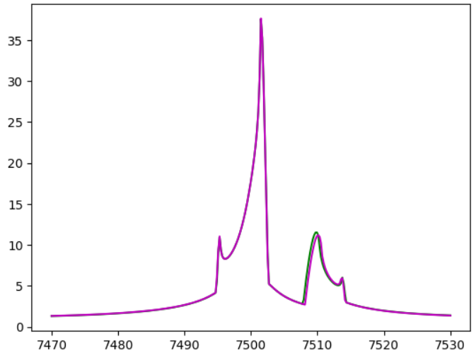
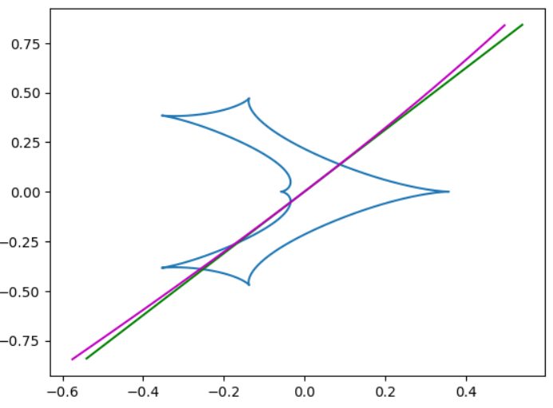

[Back to **Light Curve Functions**](LightCurves.md)

# Parallax

In the basic light curve functions discussed in the [Light Curve Functions](LightCurves.md) section, we assumed that observer, lens and source move rectilinearly. Therefore, the relative lens-source angular motion is rectilinear and described by the two parameters $u_0$ and $\alpha$.

In reality, the observer motion is curvilinear as the Earth orbits the Sun. For satellite observations, the situation is similar, since all spacecraft will describe curved orbits. In this section we will introduce a set of functions similar to the "static" ones discussed before, but including the observer motion.

First we will treat geocentric observations and then we will move to observations from space.

## Target coordinates

We need to specify J2000.0 equatorial coordinates for our microlensing target. This is done by function `SetObjectCoordinates`:

```
VBM.SetObjectCoordinates("17:59:02.3 -29:04:15.2") # Assign RA and Dec to our microlensing event
```
The string given as argument here obviously contains Right Ascension and Declination in standard notations.

## Light curve functions with parallax

All light curve functions defined in the [Light Curves](LightCurves.md) section have their corresponding counterpart including the parallax effect:

```
PSPLLightCurveParallax
ESPLLightCurveParallax
BinaryLightCurveParallax
TripleLightCurveParallax
```

The only difference is that the array of parameters must include two more entries for the components of the parallax vector. Here is a full example demonstrating the use of `BinaryLightCurveParallax`:

```
import VBMicrolensing
import math
import numpy as np
import matplotlib.pyplot as plt

VBM = VBMicrolensing.VBMicrolensing()

s = 0.9       # Separation between the lenses
q = 0.1       # Mass ratio
u0 = 0.0       # Impact parameter with respect to center of mass
alpha = 1.0       # Angle of the source trajectory
rho = 0.01       # Source radius
tE = 30.0      # Einstein time in days
t0 = 7500      # Time of closest approach to center of mass
paiN = 0.3     # North component of the parallax vector
paiE = -0.2     # East component of the parallax vector

# Array of parameters. Note that s, q, rho and tE are in log-scale
pr = [math.log(s), math.log(q), u0, alpha, math.log(rho), math.log(tE), t0, paiN, paiE]

t = np.linspace(t0-tE, t0+tE, 300) # Array of times in HJD

VBM.SetObjectCoordinates("17:59:02.3 -29:04:15.2") # Assign RA and Dec to our microlensing event

magnifications, y1, y2 = VBM.BinaryLightCurve(pr,t)      # Calculation of static binary-lens light curve
magnificationspar, y1par, y2par = VBM.BinaryLightCurveParallax(pr,t)      # Calculation of light curve with parallax

plt.plot(t,magnifications,"g")
plt.plot(t,magnificationspar,"m")
```



The light curve including parallax is in magenta in this plot. 

And here is the corresponding source trajectory
```
caustics = VBM.Caustics(s,q)
for cau in caustics:
    plt.plot(cau[0],cau[1])
plt.plot(y1,y2,"g")
plt.plot(y1par,y2par,"m")
```



In this example we have not set `VBM.t0_par`, which means that $t_{0,par}=t_0$ here.

## Satellite Parallax

VBMicrolensing can calculate the magnification as seen from a spacecraft. In order to do that, it is necessary to have the ephemeris of the satellite in the format given by the [NASA Horizons system](https://ssd.jpl.nasa.gov/horizons/app.html).

In particular, we assume five columns:
- JD
- RA (degrees)
- Dec (degrees)
- Distance from Earth (AU)
- Distance rate change (not really needed but included by default in Horizons).

Examples of valid satellite ephemeris tables are in [/VBMicrolensing/data](/VBMicrolensing/data).

The satellite table(s) should be named "satellite*.txt" (with * replaced by a single character) and placed in a single directory. In order to inform VBMicrolensing of these tables, there is an alternative version of the `VBM.SetObjectCoordinates` function:
```
coordinatefile = "OB151212coordinates.txt"
satellitedir = "/usr/data/satellitetables"
VBM.SetObjectCoordinates(coordinatefile, satellitedir)
```
The first argument is the name of a file containing the coordinates of the event, i.e. a string with RA and Dec as before (this file is for the event [OGLE-2015-BLG-1212](https://ui.adsabs.harvard.edu/abs/2016ApJ...820...79B/abstract)). The second argument is the path to the directory containing the satellite tables. When the `VBM.SetObjectCoordinates` is executed, the satellite tables are pre-loaded so that they are ready for use in any calculations.

If you want the magnification as seen from satellite 1, then just set VBM.satellite to 1 before the parallax calculation.
```
magnificationspar, y1par, y2par = VBM.BinaryLightCurveParallax(pr,t)      # Calculation of light curve with parallax
VBM.satellite = 1
magnificationssat, y1sat, y2sat = VBM.BinaryLightCurveParallax(pr,t)      # Calculation of light curve seen from Spitzer

plt.plot(t,magnificationspar,"m")
plt.plot(t,magnificationssat,"r")
```


The light curve as seen from Spitzer (satellite 1) is in red. And here we have the source trajectories

```
caustics = VBM.Caustics(s,q)
for cau in caustics:
    plt.plot(cau[0],cau[1])
plt.plot(y1par,y2par,"m")
plt.plot(y1sat,y2sat,"r")
```


If you want to return to the ground do not forget to set VBM.satellite back to 0!

Note that a warning message is printed if the input times lie outside the range of the satellite ephemeris table.

## Parallax system

By default, the parallax components are expressed in the North-East system $(\pi_{E_,N},\pi_{E,E})$. An alternative possibility is to express the parallax vector in the parallel/orthogonal components to the Earth acceleration direction $(\pi_{E,\parallel},\pi_{E,\perp})$. In VBMicrolensing you have both possibilities by setting `VBM.parallaxsystem` to 1 or 0 respectively. The default value is 1, corresponding to the North-East system.

## Reference time for parallax $t_{0,par}$

The parallax effect is introduced as a deviation of the observer from a frame centered on the Earth at a specific reference time $t_{0,par}$, in such a way that the position and the velocity of the source at time $t=t_{0,par}$ remains fixed as seen from the observer. By default, VBMicrolensing uses $t_{0,par}=t_0$, so that the light curve is unchanged at the time of closest approach to the center of mass of the lens. However, if you want to keep the source position at another time fixed, you can set `VBM.t0_par_fixed = 1` and choose your reference time via `VBM.t0_par`.

## JD vs HJD

When we include parallax, it is important to clarify whether the input time specifications are in JD or HJD. By default, VBMicrolensing assumes that times are given in $HJD' = HJD - 2450000$. However, if you want to calculate a light curve with JD' on your horizontal axis, you should just set `VBM.t_in_HJD = False` before the execution of the light curve function. All conversions are made by VBMicrolensing internally.

## Implementation of parallax calculations

In order to calculate the parallax effect, we need to track the Earth position around the Sun. We have two possibilities in VBMicrolensing: using an ephemeris table from [Horizons](https://ssd.jpl.nasa.gov/horizons/app.html), or calculate the Earth position solving the Kepler equation from [orbital elements and their secular changes](https://ssd.jpl.nasa.gov/planets/approx_pos.html).

### Ephemeris table

By default, VBMicrolensing uses an ephemeris table that is loaded on the first parallax computation. This lookup table requires fewer calculations than the Kepler equation and is more accurate. The default ephemeris runs from 1990 to 2050 in steps of one day. A warning message is printed if the input times lie outside the range of the Sun ephemeris table.
If the user needs a different time window and smaller steps, it is possible to change the ephemeris table to a different file by

```
VBM.LoadSunTable("mySunEphemeris.txt")
```

The file "mySunEphemeris.txt" should be the output of the [Horizons](https://ssd.jpl.nasa.gov/horizons/app.html) system for a geocentric ephemeris of the Sun. The output columns should be JD, RA, Dec, range, rangedot. The [default table file](/VBMicrolensing/data/SunEphemeris.txt) can be taken as reference.

### Kepler's equation calculation

In alternative, VBMicrolensing can calculate ephemeris dynamically for any time. To choose this alternative you should set

```
VBM.parallaxephemeris = False
```

The resolution of Kepler equation is slower and retrieves the Earth-Moon barycenter rather than the Earth center. So, it is also less accurate, but provides an alternative reference to check for consistency of parallax calculations.

## Terrestrial parallax

Different observers on the Earth surface see slightly different microlensing light curves due to the difference in the observation points. In order to keep this difference into account, you should generate different ephemeris tables for each observers. This is possible in [Horizons](https://ssd.jpl.nasa.gov/horizons/app.html) by changing the observer location. Then, you should separately load the right table before each light curve calculation:

```
VBM.LoadSunTable("SunEphemerisfromAfrica.txt")
magnificationsAfr, y1Afr, y2Afr = VBM.BinaryLightCurveParallax(pr,t)      # Calculation of light curve with parallax seen from Africa
VBM.LoadSunTable("SunEphemerisfromChile.txt")
magnificationsChi, y1Chi, y2Chi = VBM.BinaryLightCurveParallax(pr,t)      # Calculation of light curve with parallax seen from Chile
```

In order to appreciate the differences, you also need to choose very dense sampling in the table generation.


[Go to **Orbital motion**](OrbitalMotion.md)
