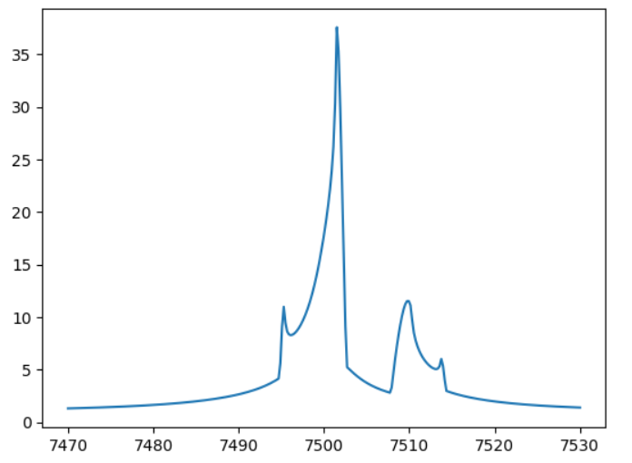

# <span style="color:red">VBMicrolensing</span>

# Documentation

In this document we will describe all use cases of the VBMicrolensing library and provide ready-to-use examples that you can copy/paste to your code. 

## Quick start

In a typical Python code, you will import the VBMicrolensing package in your project.

An instance to the ```VBMicrolensing``` class should be declared in your program. The ```VBMicrolensing``` class contains all the properties and methods that the user needs to call for any microlensing computations. Here is a basic start up example to draw a light curve for a binary lens:

```
import VBMicrolensing
import math
import numpy as np
import matplotlib.pyplot as plt

VBM = VBMicrolensing.VBMicrolensing()

s = 0.9       # Separation between the lenses
q = 0.1       # Mass ratio
u0 = 0.0       # Impact parameter with respect to center of mass
alpha = 1.0       # Angle of the source trajectory
rho = 0.01       # Source radius
tE = 30.0      # Einstein time in days
t0 = 7500      # Time of closest approach to center of mass

# Array of parameters. Note that s, q, rho and tE are in log-scale
pr = [math.log(s), math.log(q), u0, alpha, math.log(rho), math.log(tE), t0]

t = np.linspace(t0-tE, t0+tE, 300) # Array of times

magnifications, y1, y2 = VBM.BinaryLightCurve(pr,t)      # Calculation of binary-lens light curve

plt.plot(t,magnifications)
```



In this example we have declared an instance to the ```VBMicrolensing``` class, assigned values to some parameters and then we have called ```VBM.BinaryLightCurve``` to calculate the light curve with these parameters. 

## Summary

In the following pages, we will describe all functionalities of VBMicrolensing in detail.

- [Single lenses](SingleLenses.md)

- [Binary lenses](BinaryLenses.md)

- [Multiple lenses](MultipleLenses.md)

- [Critical curves and caustics](CriticalCurvesAndCaustics.md)

- [Limb Darkening](LimbDarkening.md)

- [Accuracy Control](AccuracyControl.md)

- [Light Curve Functions](LightCurves.md)

- [Parallax](Parallax.md)

- [Orbital Motion](OrbitalMotion.md)

- [Binary Sources](BinarySources.md)

- [Centroid Trajectories](CentroidTrajectories.md)

- [Advanced Control](AdvancedControl.md)
